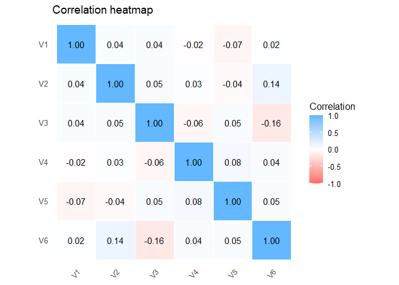

<!-- README.md is generated from README.Rmd. Please edit that file -->

# matrixCorr 

<!-- badges: start -->

[](https://CRAN.R-project.org/package=matrixCorr)

[](https://github.com/Prof-ThiagoOliveira/matrixCorr/actions/workflows/R-CMD-check.yaml)
[](https://github.com/Prof-ThiagoOliveira/matrixCorr/actions/workflows/test-coverage.yaml)
<!-- badges: end -->

`matrixCorr` computes correlation and related association matrices from
small to high-dimensional data using simple, consistent functions and
sensible defaults. It includes shrinkage and robust options for noisy or
**p \>= n** settings, plus convenient print/plot/summary methods.
Performance-critical paths are implemented in C++ with BLAS/OpenMP and
memory-aware symmetric updates. The API accepts base matrices and data
frames and returns standard R objects via a consistent S3 interface.

Contributions from other researchers who want to add new correlation
methods are very welcome. A central goal of `matrixCorr` is to keep
efficient correlation and agreement estimation in one package with a
common interface and consistent outputs, so methods can be extended,
compared, and used without repeated translation across packages.

Supported measures include Pearson, Spearman, Kendall, distance
correlation, partial correlation, robust biweight mid-correlation,
percentage bend, Winsorized, skipped correlation, and latent
categorical/ordinal correlations (tetrachoric, polychoric, polyserial,
and biserial), plus repeated-measures correlation (`rmcorr()`);
agreement tools cover Cohen’s kappa for nominal ratings, weighted
Cohen’s kappa for ordered two-rater agreement, multi-rater kappa for
nominal panel agreement, Bland-Altman (two-method and
repeated-measures), Lin’s concordance correlation coefficient (including
repeated-measures LMM/REML extensions), and intraclass correlation for
both wide and repeated-measures designs.

## Features

| Area | Functions and tools |
|----|----|
| Backend | High-performance C++ backend using `Rcpp` |
| General correlations | `pearson_corr()`, `spearman_rho()`, `kendall_tau()` |
| Robust correlations | `bicor()`, `pbcor()`, `wincor()`, `skipped_corr()` |
| Distance correlation | `dcor()`, `robust_dcor()` |
| Partial correlation | `pcorr()` |
| Latent categorical/ordinal correlations | `tetrachoric()`, `polychoric()`, `polyserial()`, `biserial()` |
| Repeated-measures correlation | `rmcorr()` |
| Shrinkage for $p >> n$ | `shrinkage_corr()` |
| Agreement: two-rater categorical ratings | `cohen_kappa()` for nominal categories, `weighted_kappa()` for ordered categories |
| Agreement: multi-rater nominal ratings | `multirater_kappa()` |
| Agreement: Bland-Altman | Two-method or pairwise wide-input `ba()`, repeated-measures `ba_rm()` |
| Agreement: probability of agreement | `prob_agree()` |
| Agreement: concordance | Pairwise Lin’s CCC `ccc()`, repeated-measures LMM/REML `ccc_rm_reml()`, non-parametric `ccc_rm_ustat()` |
| Agreement: intraclass correlation | Wide-data `icc()` with pairwise and overall scope, repeated-measures REML `icc_rm_reml()` |
| Interactive viewers | Matrix-style Shiny viewers, including the repeated-measures correlation viewer `view_rmcorr_shiny()` |

## Installation

``` r
# Install from CRAN
install.packages("matrixCorr")

# Development version from GitHub
# install.packages("remotes")
remotes::install_github("Prof-ThiagoOliveira/matrixCorr")
```

## Thread settings (`n_threads`)

Most computational functions expose an `n_threads` argument and default
to:

``` r
getOption("matrixCorr.threads", 1L)
```

To define a package-wide default once per session:

``` r
options(matrixCorr.threads = parallel::detectCores(logical = FALSE))
```

## Quick start

### Wide-data correlation workflow

``` r
library(matrixCorr)

set.seed(1)
X <- as.data.frame(matrix(rnorm(300 * 6), ncol = 6))
names(X) <- paste0("V", 1:6)

R_pear <- pearson_corr(X, ci = TRUE)
R_bicor <- bicor(X)

print(R_pear, digits = 2)
#> Pearson correlation matrix
#>   method      : pearson
#>   dimensions  : 6 x 6
#>   ci          : yes
#> 
#>       V1    V2    V3    V4    V5    V6
#> V1  1.00  0.02  0.04 -0.02 -0.07  0.01
#> V2  0.02  1.00  0.04  0.03 -0.05  0.13
#> V3  0.04  0.04  1.00 -0.06  0.08 -0.14
#> V4 -0.02  0.03 -0.06  1.00  0.07  0.03
#> V5 -0.07 -0.05  0.08  0.07  1.00  0.04
#> V6  0.01  0.13 -0.14  0.03  0.04  1.00
summary(R_pear)
#> Pearson correlation summary
#>   output      : matrix
#>   dimensions  : 6 x 6
#>   retained_pairs: 21
#>   threshold   : 0.0000
#>   diag        : included
#>   estimate    : -0.1410 to 1.0000
#>   ci          : 95%
#>   ci_method   : fisher_z
#>   ci_width    : 0.222 to 0.226
#>   cross_zero  : 13 pair(s)
#> 
#>  item1 item2 estimate n_complete lwr     upr     fisher_z statistic p_value
#>  V3    V6    -0.1410  300        -0.2502 -0.0282 -0.1419  -2.4459   0.0144 
#>  V2    V6    0.1272   300        0.0142  0.2371  0.1279   2.2047    0.0275 
#>  V3    V5    0.0776   300        -0.0360 0.1892  0.0778   1.3401    0.1802 
#>  V4    V5    0.0724   300        -0.0412 0.1841  0.0725   1.2491    0.2116 
#>  V1    V5    -0.0650  300        -0.1770 0.0486  -0.0651  -1.1222   0.2618 
#>  ...   ...   ...      ...        ...     ...     ...      ...       ...    
#>  V2    V4    0.0335   300        -0.0801 0.1462  0.0335   0.5773    0.5638 
#>  V4    V6    0.0324   300        -0.0811 0.1451  0.0324   0.5584    0.5766 
#>  V1    V2    0.0236   300        -0.0899 0.1365  0.0236   0.4064    0.6845 
#>  V1    V4    -0.0185  300        -0.1315 0.0949  -0.0185  -0.3187   0.7500 
#>  V1    V6    0.0130   300        -0.1004 0.1261  0.0130   0.2243    0.8225 
#> ... 5 more rows not shown (omitted)
#> Use as.data.frame()/tidy()/as.matrix() to inspect the full result.
#> 
#> Strongest pairs by |estimate|
#> 
#>  item1 item2 estimate n_complete lwr     upr     fisher_z statistic p_value
#>  V3    V6    -0.1410  300        -0.2502 -0.0282 -0.1419  -2.4459   0.0144 
#>  V2    V6    0.1272   300        0.0142  0.2371  0.1279   2.2047    0.0275 
#>  V3    V5    0.0776   300        -0.0360 0.1892  0.0778   1.3401    0.1802 
#>  V4    V5    0.0724   300        -0.0412 0.1841  0.0725   1.2491    0.2116 
#>  V1    V5    -0.0650  300        -0.1770 0.0486  -0.0651  -1.1222   0.2618
plot(R_bicor)
```



The same matrix-style workflow extends to Spearman, Kendall, distance
correlation, partial correlation, shrinkage correlation, latent
correlation, and the robust estimators `pbcor()`, `wincor()`, and
`skipped_corr()`.

### Agreement and repeated-measures workflow

``` r
set.seed(6)
S <- 24
Tm <- 4
id <- factor(rep(seq_len(S), each = 2 * Tm))
method <- factor(rep(rep(c("A", "B"), each = Tm), times = S))
time <- rep(rep(seq_len(Tm), times = 2), times = S)

u <- rnorm(S, 0, 0.9)[as.integer(id)]
um <- rnorm(S * 2, 0, 0.25)
um <- um[(as.integer(id) - 1L) * 2L + as.integer(method)]
y <- u + um + (method == "B") * 0.2 + rnorm(length(id), 0, 0.35)

dat_rm <- data.frame(y, id, method, time)

fit_ccc_rm <- ccc_rm_reml(
  dat_rm,
  response = "y",
  subject = "id",
  method = "method",
  time = "time"
)

summary(fit_ccc_rm)
#> 
#> Repeated-measures concordance (REML)
#> 
#> Concordance estimates
#> 
#>  item1 item2 estimate n_subjects n_obs SB     se_ccc
#>  A     B     0.8841   24         192   0.0548 0.0216
#> 
#> Variance components
#> 
#>  sigma2_subject sigma2_subject_method sigma2_subject_time sigma2_error
#>  0.7866         0.0176                0                   0.1229      
#> 
#> AR(1) diagnostics
#> 
#>  ar1_rho ar1_rho_lag1 ar1_rho_mom ar1_pairs ar1_pval use_ar1 ar1_recommend
#>  -0.1256 -0.1256      -0.1256     144       0.1318   FALSE   FALSE
```

Agreement and reliability methods use the same general inspection
pattern, but they target different quantities. The package includes
Cohen’s kappa for nominal two-rater ratings, weighted kappa for ordered
two-rater ratings, multi-rater kappa for nominal panel agreement,
Bland-Altman analysis, concordance correlation, and intraclass
correlation for both wide and repeated-measures designs.

## Vignettes

The package documentation is organised as a set of workflow vignettes.
The README is intentionally brief; the vignettes are the main user
guide.

Start here:

- `vignette("v01-matrixCorr-introduction", package = "matrixCorr")`
  introduces the package structure, common object behaviour, and shared
  display conventions.
- `vignette("v02-wide-correlation-workflows", package = "matrixCorr")`
  covers Pearson, Spearman, Kendall, distance correlation, and the
  general wide-data matrix workflow.
- `vignette("v03-robust-and-highdim-correlation", package = "matrixCorr")`
  covers robust estimators, shrinkage, and high-dimensional settings.
- `vignette("v04-latent-and-mixed-scale-correlation", package = "matrixCorr")`
  covers tetrachoric, polychoric, polyserial, and biserial correlation.
- `vignette("v05-agreement-and-icc-wide", package = "matrixCorr")`
  covers Bland-Altman analysis, concordance, and intraclass correlation
  for wide data.
- `vignette("v06-repeated-measures-workflows", package = "matrixCorr")`
  covers repeated-measures correlation, repeated agreement, and repeated
  reliability workflows.

If you want a compact overview of the available estimators, start with
the introduction vignette and then move to the workflow family that
matches your data layout and scientific question.

## Contributing

Issues and pull requests are welcome. Please see `CONTRIBUTING.md` for
guidelines and `cran-comments.md`/`DESCRIPTION` for package metadata.

## License

MIT [Thiago de Paula Oliveira](https://orcid.org/0000-0002-4555-2584)

See inst/LICENSE for the full MIT license text.
